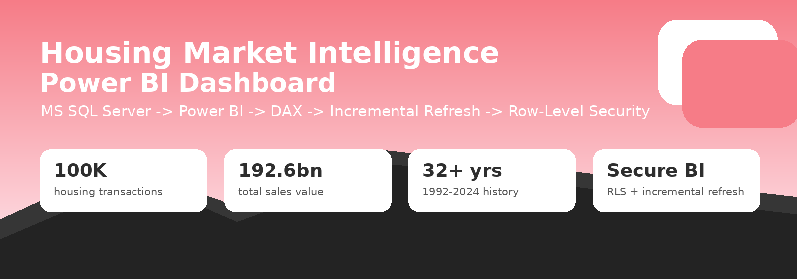
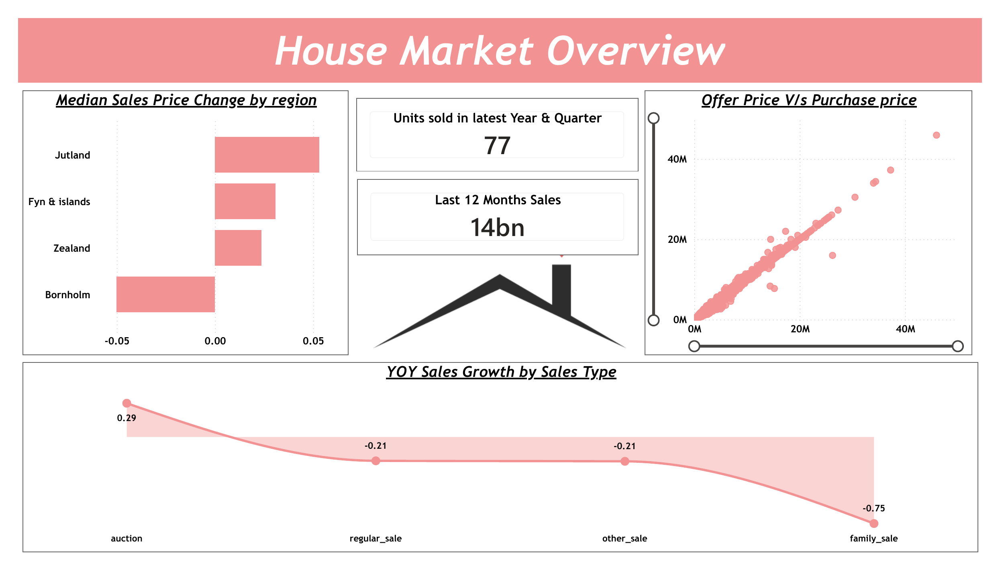
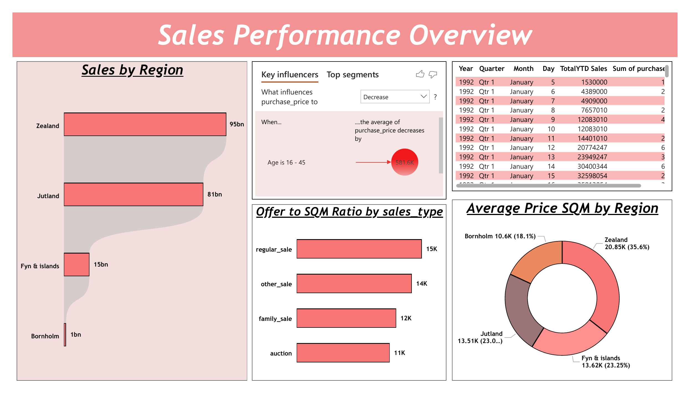
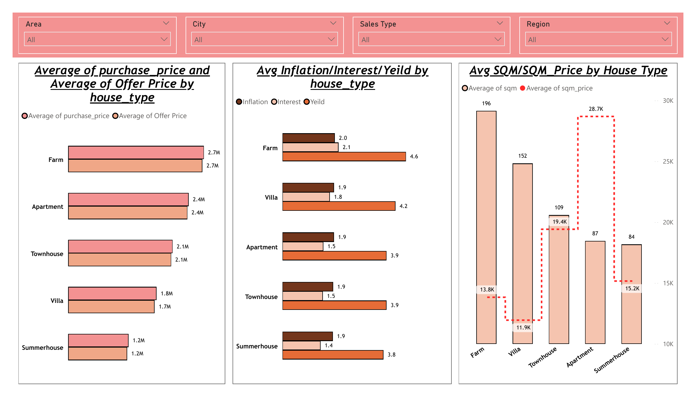
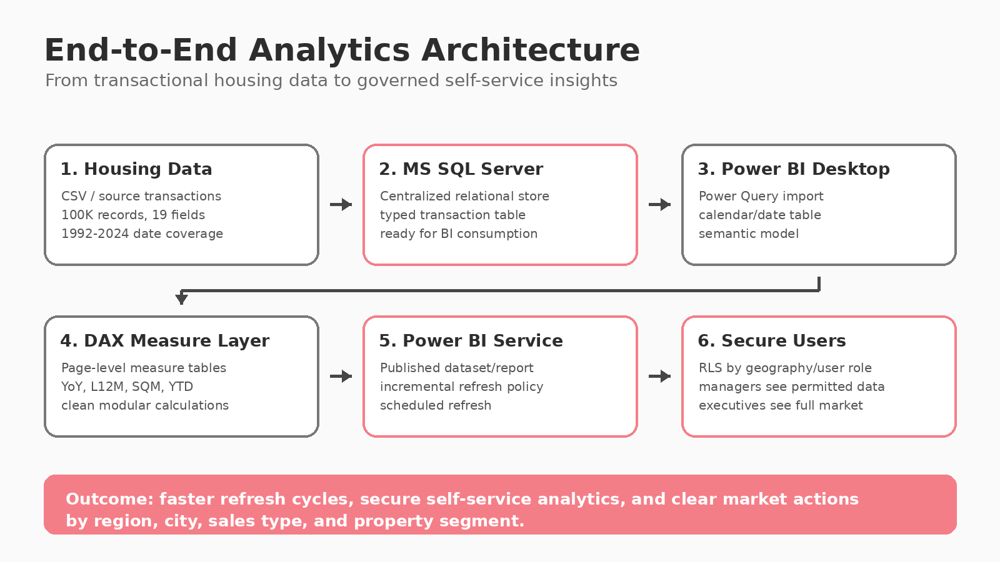
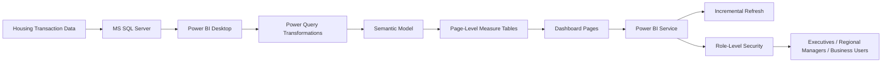

# Housing Market Intelligence Dashboard



<p align="center">
  
  
  
  
</p>

## Project Snapshot

This project is an end-to-end **housing market analytics solution** built on **MS SQL Server and Power BI**. The dataset was stored in SQL Server, imported into Power BI, modeled with page-level DAX measure tables, and published to Power BI Service with **incremental refresh** and **role-level security (RLS)**.

The goal was not only to build charts, but to create a recruiter-ready business intelligence project that answers real executive questions: where revenue is coming from, which regions are premium markets, which sales types are growing or weakening, how closely offers match final purchase prices, and where the business should focus sales, pricing, and investment decisions.

---

## Executive Highlights

| KPI | Result |
|---|---:|
| Transactions analyzed | **100,000** |
| Dataset coverage | **1992-01-05 to 2024-10-24** |
| Total sales value | **192.6bn** |
| Median purchase price | **1.40M** |
| Average price per sqm | **16.4K** |
| Latest quarter in data | **2024Q4** |
| Units sold in latest quarter | **77** |
| Last 12 months sales value | **13.7bn** |

> Note: monetary values are shown in the source dataset's native currency/unit. The latest 2024 quarter is partial because the dataset ends on 2024-10-24.

---

## Business Questions Answered

| # | Business Question | Insight Delivered | Business Impact |
|---:|---|---|---|
| 1 | How large is the market and how active is it recently? | 100K transactions, 192.6bn total sales value, 13.7bn in last 12 months sales. | Gives executives a clear market-size baseline for planning and performance reviews. |
| 2 | Which regions generate the most revenue? | Zealand contributes ~95.0bn, followed by Jutland with ~81.5bn. Together they represent over 91% of total sales value. | Helps prioritize regional sales teams, marketing budgets, and leadership attention. |
| 3 | Which regions are premium vs. affordable? | Zealand has the highest average price per sqm at ~20.9K; Bornholm is the most affordable at ~10.6K. | Supports differentiated pricing, investment positioning, and market segmentation. |
| 4 | Are offer prices aligned with purchase prices? | Offer and purchase prices are highly aligned, with a correlation of ~0.998. Around 64% of transactions close at the calculated offer price. | Helps validate pricing strategy and identify outlier deals that need review. |
| 5 | Which sales types are growing or declining? | Auction sales show the strongest latest YoY growth in the data, while regular, other, and family sales are down in the partial 2024 period. | Enables sales-type monitoring and prevents leadership from treating incomplete-period declines as final-year performance. |
| 6 | Which property types are most valuable? | Farms have the highest average purchase price (~2.74M), while apartments command the highest average price per sqm (~28.7K). | Helps separate absolute property value from density/premium-location value. |
| 7 | Which cities should the business focus on? | København S, Aarhus C, København A, Roskilde, Silkeborg, and Aalborg lead by total sales value. | Guides local market campaigns and city-level investment strategy. |
| 8 | How does property age influence pricing? | Newer homes, especially 0-15 years old, show the highest median purchase price (~2.16M). The Power BI key-influencer visual also flags the 16-45 age band as a price-decreasing segment. | Supports product positioning, renovations strategy, and valuation assumptions. |
| 9 | How can the report scale securely for business users? | Incremental refresh avoids reprocessing decades of history; RLS restricts user views by role/geography. | Improves refresh efficiency, governance, and secure self-service analytics. |

---

## Dashboard Preview

### 1. House Market Overview

This page gives leaders a fast market pulse: latest units sold, last 12 months sales, regional median price change, offer-vs-purchase alignment, and YoY sales growth by sales type.



### 2. Sales Performance Overview

This page focuses on where sales value is concentrated, how price per sqm differs by region, how offer-to-sqm ratio changes by sales type, and what factors influence purchase price.



### 3. Property Type and Pricing Deep Dive

This page uses interactive slicers for area, city, sales type, and region, then compares purchase price, offer price, inflation, interest, yield, sqm, and sqm price by house type.



---

## Data Story: From Transactions to Decisions

The analysis shows that the market is highly concentrated geographically. **Zealand and Jutland dominate revenue**, but they behave differently: Zealand is the premium market by price per sqm, while Jutland contributes high volume and positive recent median price movement. This creates two different business plays: premium-market pricing discipline in Zealand and volume-led growth monitoring in Jutland.

Offer and purchase prices are closely aligned, meaning the offer-pricing process is generally reliable. However, the small share of transactions closing above or below offer can be turned into an exception-monitoring workflow for pricing teams.

At the property level, **farms lead in average purchase price**, but **apartments lead in price per sqm**. This distinction is important for executives because total price and unit economics tell different stories. Farms represent large-ticket assets, while apartments represent dense, premium-location pricing.

The project also shows production-minded BI design. By using SQL Server as the source, Power BI as the semantic layer, incremental refresh in the Service, and RLS for governed access, the dashboard is built for business use rather than one-time analysis.

---

## Technical Architecture





---

## Power BI Implementation Highlights

### Data Modeling

- Imported housing transaction data from **MS SQL Server** into Power BI.
- Built a clean semantic model around the transaction table.
- Created time intelligence support for year, quarter, month, YTD, and last 12 months views.
- Organized DAX into **separate measure tables by report page** to improve readability and maintainability.

### Measures and Analytics Logic

Representative DAX patterns used in this project include:

```DAX
Total Sales =
SUM ( 'Housing Data'[purchase_price] )
```

```DAX
Units Sold =
COUNTROWS ( 'Housing Data' )
```

```DAX
Last 12 Months Sales =
CALCULATE (
    [Total Sales],
    DATESINPERIOD ( 'Date'[Date], MAX ( 'Date'[Date] ), -12, MONTH )
)
```

```DAX
YoY Sales Growth % =
DIVIDE ( [Total Sales] - [Total Sales PY], [Total Sales PY] )
```

```DAX
Offer Price =
SUMX (
    'Housing Data',
    'Housing Data'[purchase_price]
        * ( 1 + 'Housing Data'[%_change_between_offer_and_purchase] / 100 )
)
```

```DAX
Offer to SQM Ratio =
DIVIDE ( [Offer Price], SUM ( 'Housing Data'[sqm] ) )
```

### Incremental Refresh

Implemented incremental refresh in Power BI Service so that historical housing records do not need to be fully reprocessed on every refresh. This is especially useful because the dataset covers more than three decades of transactions.

Typical configuration pattern:

1. Create `RangeStart` and `RangeEnd` parameters.
2. Filter the transaction date column in Power Query.
3. Define historical storage and refresh windows.
4. Publish to Power BI Service.
5. Validate partition refresh behavior after publishing.

### Role-Level Security

Implemented RLS in Power BI Service to support governed self-service reporting. Regional managers can be restricted to their own geography while executive users can access the full market view.

Example RLS logic pattern:

```DAX
'Housing Data'[region] = "Zealand"
```

For larger teams, the same design can be extended to dynamic security using a user-access mapping table and `USERPRINCIPALNAME()`.

---

## Key Insights

### Regional Performance

| Region | Sales Value | Share of Sales | Transactions | Avg Price / SQM |
|---|---:|---:|---:|---:|
| Zealand | 95.0bn | 49.3% | 39,740 | 20.9K |
| Jutland | 81.5bn | 42.3% | 49,937 | 13.5K |
| Fyn & islands | 14.9bn | 7.7% | 9,264 | 13.6K |
| Bornholm | 1.2bn | 0.6% | 1,059 | 10.6K |

### House Type Positioning

| House Type | Avg Purchase Price | Avg Offer Price | Avg SQM | Avg SQM Price | Strategic Read |
|---|---:|---:|---:|---:|---|
| Farm | 2.74M | 2.70M | 196 | 13.8K | Highest ticket size, large-area assets. |
| Apartment | 2.43M | 2.40M | 87 | 28.7K | Highest density premium by sqm. |
| Townhouse | 2.11M | 2.08M | 109 | 19.4K | Strong middle-market urban segment. |
| Villa | 1.79M | 1.74M | 152 | 11.9K | Largest volume property type. |
| Summerhouse | 1.22M | 1.19M | 84 | 15.2K | Lower average ticket, lifestyle segment. |

### Top Cities by Sales Value

| Rank | City | Sales Value | Transactions | Median Price |
|---:|---|---:|---:|---:|
| 1 | København S | 4.11bn | 1,275 | 2.85M |
| 2 | Aarhus C | 3.34bn | 1,059 | 2.65M |
| 3 | København A | 2.75bn | 721 | 3.25M |
| 4 | Roskilde | 2.62bn | 988 | 2.28M |
| 5 | Silkeborg | 2.56bn | 1,103 | 1.88M |
| 6 | Aalborg | 2.52bn | 1,136 | 1.75M |

---

## Business Impact

| Area | Impact |
|---|---|
| Revenue prioritization | Identifies Zealand and Jutland as the most important revenue regions and highlights top-performing cities. |
| Pricing strategy | Uses price per sqm, offer-to-purchase alignment, and house type analysis to guide pricing decisions. |
| Executive reporting | Converts raw housing transactions into a clean Power BI story for leadership consumption. |
| Operational efficiency | Incremental refresh reduces unnecessary full-history refresh work in the Power BI Service. |
| Governance | RLS enables secure access for different user groups without duplicating reports. |
| Portfolio value | Demonstrates SQL, Power BI, DAX, data modeling, analytics engineering, and business storytelling in one project. |

---

## Recommended Repository Structure

```text
housing-market-intelligence-dashboard/
|
|-- README.md
|-- data/
|   |-- Housing Data.csv
|   |-- Housing Data Column Definitions.xlsx
|
|-- notebooks/
|   |-- Housing_Market_EDA.ipynb
|
|-- powerbi/
|   |-- House_Market_Dashboard.pbix
|
|-- reports/
|   |-- house_market_dashboard.pdf
|   |-- Housing_Market_Project_Report.pdf
|
|-- assets/
|   |-- 00_project_banner.png
|   |-- 01_house_market_overview.png
|   |-- 02_sales_performance_overview.png
|   |-- 03_property_type_pricing.png
|   |-- 04_architecture.png
```

---

## How to Reproduce

1. Load the housing dataset into **MS SQL Server**.
2. Connect Power BI Desktop to the SQL Server table or view.
3. Apply Power Query transformations and create a calendar/date table.
4. Build the semantic model and page-level measure tables.
5. Create dashboard pages for market overview, sales performance, and property-type pricing.
6. Configure incremental refresh using `RangeStart` and `RangeEnd` date parameters.
7. Publish to Power BI Service.
8. Configure and test RLS roles.
9. Validate insights against the EDA notebook.

---

## Tools and Skills Demonstrated

- **MS SQL Server**: data storage and BI-ready source layer
- **Power BI Desktop**: data modeling, report design, slicers, KPI cards, visual storytelling
- **DAX**: time intelligence, YoY growth, last 12 months sales, offer price calculations, ratios
- **Power BI Service**: incremental refresh, scheduled refresh, RLS deployment
- **Python EDA**: validation of metrics and business question exploration
- **Business Intelligence Storytelling**: translating dashboards into actions for executives

---

## Final Takeaway

This project demonstrates how raw housing transactions can be transformed into a secure, scalable, and decision-ready BI product. It combines analytical depth with production-aware Power BI practices, making it a strong portfolio project for roles in **Data Analytics, Business Intelligence, Power BI Development, and Analytics Engineering**.
